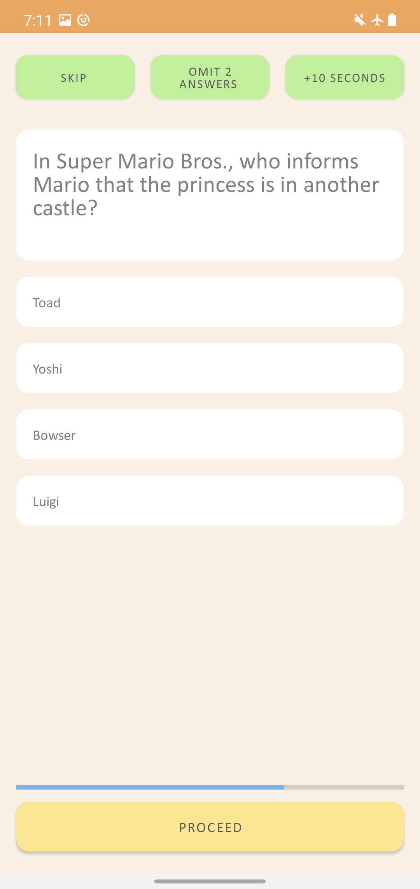

# Trivia Quiz App

## General
This is a trivia quiz app. I built the app with Android Studio Arctic Fox|2020.3.1 and Java 11.

## Structure

This app uses local database for the question pool. The questions were taken from
[Open Trivia Database](https://opentdb.com/api_config.php).

Trivia Quiz App uses Jetpack libraries and coroutines.

The integration tests can be pushed further and test complex scenarios. I tested the required 
functionalities.

## Download

You can download a debug apk from [here](https://www.dropbox.com/s/eekz804k3ls43bu/app-debug.apk?dl=0)

